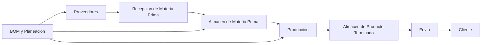

# Master Plan 2026 - Transformacion Operativa Aromaria

## 1. Proposito

Construir un sistema operativo industrial para Aromaria que permita escalar la operacion sin perder control, calidad, trazabilidad ni rentabilidad.

El plan busca estandarizar cada macroproceso de la cadena de valor, resolver sus principales problematicas operativas y crear una estructura de tableros en Monday.com que refleje la realidad fisica de la nave.

La meta no es solo digitalizar la operacion actual, sino ordenar, estabilizar y despues automatizar.

---

## 2. Objetivos generales

1. Estandarizar los macroprocesos criticos de Aromaria.
2. Crear trazabilidad total desde materia prima hasta su envío.
3. Reducir merma, retrabajos, rechazos y producto detenido.
4. Formalizar roles, responsabilidades, handoffs y criterios de decision.
5. Construir una arquitectura de Monday.com que refleje la cadena de valor real.
6. Medir KPIs operativos confiables por macroproceso.
7. Preparar la operacion para automatizacion, ERP/MRP y escalamiento.

---

## 3. Principios de diseno

- Primero ordenar, despues automatizar.
- Ningun material se usa sin liberacion.
- Ningun movimiento fisico debe ocurrir sin registro.
- Todo producto detenido debe tener causa, owner y fecha compromiso.
- Monday.com debe reflejar la realidad fisica, no una version parcial de ella.
- Cada macroproceso debe tener entradas, salidas, responsables, KPIs y reglas claras.
- WhatsApp puede servir para comunicacion rapida, pero no como sistema de registro.
- Los tableros deben facilitar la operacion diaria, no solo reportar a direccion.

---

## 4. Cadena de valor objetivo

Cada orden, lote, insumo o producto debe poder ubicarse dentro de esta cadena con un estatus operativo claro.

---

## 5. Arquitectura Monday.com objetivo

### 5.1 Boards maestros

Estos boards funcionan como catalogos o fuentes de verdad.

| Board | Funcion |
|---|---|
| Productos / SKUs | Catalogo maestro de productos terminados |
| Insumos | Catalogo maestro de materia prima, envases, etiquetas, cajas y consumibles |
| Aromas / Esencias | Catalogo de aromas y formulas |
| Proveedores | Catalogo de proveedores, score y condiciones |
| Clientes | Catalogo de clientes B2B, B2C, Palacio, UK y especiales |
| Personas | Catalogo de responsables, operadores e inspectores |
| Etapas de Produccion | Catalogo de etapas productivas por categoria |
| Categorias de Producto | Clasificacion de productos por proceso y BOM |
| BOM / Recetas | Receta de insumos por producto, version y lote estandar |

### 5.2 Boards transaccionales

Estos boards registran eventos reales de la operacion.

| Board | Macroproceso | Funcion |
|---|---|---|
| Ordenes de Compra / ODCs | Compras / Recepcion | Visibilidad de lo que viene en transito |
| Recepcion de MP | Recepcion MP | Registro de llegada, inspeccion y decision |
| No Conformidades de Proveedor | Recepcion MP / Calidad | Rechazos, devoluciones, defectos y evidencia |
| Inventario MP / Kardex MP | Almacen MP | Entradas, salidas, ajustes, apartados y stock real |
| Solicitudes de Insumos | Almacen MP / Produccion | Requerimientos internos y surtido parcial |
| MPS - Ordenes de Produccion | Produccion | Cabecera de orden/lote de produccion |
| Productos en Lote | Produccion | SKUs dentro de cada orden de produccion |
| Avances de Produccion | Produccion | Registro por etapa, fecha, cantidad y operador |
| Merma y Producto No Conforme | Produccion / Calidad | Merma, causa raiz, costo y disposicion |
| Liberaciones de Calidad | Calidad | Inspecciones, aprobaciones y bloqueos |
| Inventario PT / Kardex PT | Almacen PT | Entradas, salidas, apartados, stock detenido |
| Solicitudes de Surtido | Almacen PT / Envio | Pedidos internos hacia embalaje o fulfillment |
| Pedidos y Envios | Envio | Preparacion, embalaje, despacho y tracking |
| Incidencias Operativas | Transversal | Bloqueos, urgencias, fallas y acciones correctivas |

### 5.3 Dashboards ejecutivos

| Dashboard | Audiencia | Contenido |
|---|---|---|
| Control Operativo Diario | Mandos medios | Ordenes detenidas, rechazos, merma, pendientes, atrasos |
| Calidad y Proveedores | Calidad / Compras | PPM, rechazos, devoluciones, costo de mala calidad |
| Produccion MPS | Produccion / Direccion | Avance por lote, leadtime, cumplimiento, FPY, productividad |
| Inventarios | Almacenes / Planeacion | IRA, desviaciones, stock critico, apartados, antiguedad |
| Envio y Fulfillment | Logistica / Direccion | Pedidos enviados, pendientes, atrasos, tarimas, rutas |
| Direccion General | Direccion | Riesgos, costos, capacidad, tendencia de KPIs |

---

## 6. Estandarizacion por macroproceso

## 6.1 Macroproceso 1 - Recepcion de Materia Prima

### Problematica principal

Recepcion opera con poca prevencion. Hay devoluciones gestionadas fuera de sistema, falta acceso a especificaciones de compra, hay tableros desactualizados y la calidad de proveedor genera inspeccion excesiva, retrasos y riesgo de usar material defectuoso.

### Objetivo

Implementar una recepcion preventiva, documentada y bloqueante: si el material no cumple, no entra a flujo productivo.

### Acciones clave

1. Crear politica "No entra si no cumple".
2. Formalizar checklist de recepcion por categoria de insumo.
3. Exigir documentacion previa: COA, ficha tecnica, lote, evidencia visual y especificaciones.
4. Crear board de ODCs en transito con acceso para Recepcion.
5. Crear flujo formal de rechazo/devolucion a proveedor.
6. Implementar cuarentena fisica y digital.
7. Crear scorecard de proveedores.

### Boards Monday requeridos

| Board | Tipo | Comentario |
|---|---|---|
| ODCs en Transito | Transaccional | Debe conectar Compras con Recepcion |
| Recepcion de MP | Transaccional | Registro de llegada, inspeccion y liberacion |
| No Conformidades de Proveedor | Transaccional | Evidencia, defecto, costo, devolucion |
| Proveedores | Maestro | Score, PPM, condiciones, historial |
| Especificaciones de Insumos | Maestro | Criterios de aceptacion por insumo |

### Estatus sugeridos

- Esperado
- Recibido pendiente de inspeccion
- En cuarentena
- Aprobado
- Aprobado con desviacion
- Rechazado
- Devuelto a proveedor
- Pendiente de nota de credito / reposicion

### KPIs

- PPM proveedor
- % ODCs no conformes
- % ODCs con retraso
- Tiempo promedio de liberacion
- Costo de mala calidad proveedor

---

## 6.2 Macroproceso 2 - Almacen de Materia Prima

### Problematica principal

El stock disponible real no siempre coincide con el stock en sistema. Hay apartados informales, salidas no registradas, captura manual excesiva, datos dispersos e inventarios con dependencia de personas clave.

### Objetivo

Controlar el inventario real, comprometido y disponible, con movimientos trazables y reglas claras de surtido.

### Acciones clave

1. Separar stock fisico en: disponible, apartado, cuarentena, rechazado y obsoleto.
2. Registrar apartados para produccion en Monday.
3. Implementar Kardex por familia de insumo.
4. Formalizar solicitudes internas de insumos.
5. Medir tiempo de respuesta de almacen.
6. Implementar conteos ciclicos por criticidad.
7. Evaluar scanners, codigos de barras y etiquetas Dymo.

### Boards Monday requeridos

| Board | Tipo | Comentario |
|---|---|---|
| Inventario MP | Transaccional / Stock | Stock actual por SKU y ubicacion |
| Kardex MP | Transaccional | Entradas, salidas, ajustes, transferencias |
| Solicitudes de Insumos | Transaccional | Produccion pide; almacen surte |
| Apartados de MP | Transaccional | Material comprometido por orden |
| Auditorias de Inventario MP | Transaccional | Conteos ciclicos e IRA |

### Estatus sugeridos

- Disponible
- Apartado
- En surtido
- Entregado a produccion
- En cuarentena
- Rechazado
- Obsoleto
- Bajo minimo

### KPIs

- IRA
- % desviacion de inventario
- Tiempo promedio de respuesta a solicitudes
- % SKUs en nivel verde
- Valor de stock comprometido no surtido

---

## 6.3 Macroproceso 3 - Produccion

### Problematica principal

El MPS existe, pero todavia hay producto detenido sin visibilidad, fechas compromiso poco claras, KPIs semanales fuera de Monday, falta de BOM completo, liberacion de calidad como cuello de botella y bloqueos por insumos.

### Objetivo

Gestionar cada orden de produccion por lote, producto, etapa, avance, calidad, merma y bloqueo, con visibilidad diaria.

### Acciones clave

1. Consolidar MPS como tablero rector de ordenes de produccion.
2. Conectar cada orden con productos en lote, BOM, insumos, avances y PT.
3. Asignar fecha compromiso a cada lote.
4. Crear dashboard de items detenidos por antiguedad.
5. Registrar avance diario por etapa.
6. Formalizar liberaciones de calidad por etapa critica.
7. Registrar merma y producto no conforme con causa y costo.
8. Completar BOM por linea de producto.

### Boards Monday requeridos

| Board | Tipo | Comentario |
|---|---|---|
| MPS - Ordenes de Produccion | Transaccional | Cabecera de orden/lote |
| Productos en Lote | Transaccional | SKUs y cantidades dentro del lote |
| Avances de Produccion | Transaccional | Etapa, fecha, cantidad, operador |
| BOM / Recetas | Maestro / Versionado | Insumos requeridos por SKU |
| Merma y Producto No Conforme | Transaccional | Causa, costo, disposicion |
| Liberaciones de Calidad | Transaccional | Inspeccion, bloqueo, aprobacion |
| Etapas por Categoria | Maestro | Flujo esperado por tipo de producto |

### Estatus sugeridos para orden de produccion

- Planeada
- Esperando insumos
- Lista para producir
- En produccion
- Detenida
- En inspeccion de calidad
- Liberada
- Entregada a PT
- Cerrada
- Cancelada

### KPIs

- Leadtime de produccion
- Cumplimiento de fecha compromiso
- First Pass Yield
- % merma
- Costo de merma
- Piezas producidas por semana
- Ordenes detenidas por causa
- Productividad por operador / linea

---

## 6.4 Macroproceso 4 - Almacen de Producto Terminado

### Problematica principal

El inventario no refleja todo el stock fisico. Hay producto especial o detenido fuera de sistema, dos boards en transicion, ecommerce sin Kardex y producto estancado sin alertas.

### Objetivo

Tener control total del producto terminado: disponible, apartado, detenido, especial, ecommerce, Palacio, UK y B2B.

### Acciones clave

1. Definir un solo board rector de Inventario PT.
2. Migrar y cerrar boards legacy con fecha de corte.
3. Registrar todo producto fisico, aunque no este disponible para venta.
4. Crear Kardex PT para entradas, salidas y ajustes.
5. Implementar control de antiguedad y producto sin movimiento.
6. Separar stock por canal: ecommerce, Palacio, UK, B2B, especial.
7. Formalizar criterios para devoluciones de Palacio y producto detenido.

### Boards Monday requeridos

| Board | Tipo | Comentario |
|---|---|---|
| Inventario PT | Stock | Fuente de verdad del producto terminado |
| Kardex PT | Transaccional | Entradas, salidas, ajustes |
| Producto Detenido / Bloqueado | Transaccional | Causa, owner, decision |
| Solicitudes de Surtido | Transaccional | Pedidos internos hacia envio |
| Auditorias Inventario PT | Transaccional | Conteos ciclicos e IRA |

### Estatus sugeridos

- Disponible
- Apartado
- Detenido
- En inspeccion
- Bloqueado por calidad
- Reservado para canal
- En surtido
- Entregado a envio
- Obsoleto / baja

### KPIs

- IRA PT
- % desviacion de inventario
- Producto detenido por antiguedad
- Dias sin movimiento
- Pedidos surtidos a tiempo
- Valor de inventario bloqueado

---

## 6.5 Macroproceso 5 - Envio

### Problematica principal

Hay roles mezclados, procesos fuera de Monday, picos de carga por entregas tardias de produccion, KPIs por WhatsApp, pedidos especiales sin flujo formal e insumos de embalaje sin punto de reorden.

### Objetivo

Controlar el flujo de pedidos desde solicitud hasta despacho, con visibilidad de pendientes, atrasos, responsable, canal y tracking.

### Acciones clave

1. Definir estructura organizacional de embalaje y mesa de control.
2. Separar roles administrativos y operativos.
3. Crear flujo formal para UK, Palacio, ecommerce, B2B y pedidos especiales.
4. Conectar solicitudes de surtido con inventario PT y pedidos.
5. Registrar contingencias de eShip.
6. Medir pedidos procesados, atrasados y enviados.
7. Nivelar entregas de produccion a embalaje durante el dia.
8. Crear puntos de reorden para insumos de embalaje.

### Boards Monday requeridos

| Board | Tipo | Comentario |
|---|---|---|
| Pedidos y Envios | Transaccional | Board rector de salida a cliente |
| Corte de Pedidos | Transaccional | Priorizacion diaria/semanal |
| Solicitudes de Surtido | Transaccional | Conexion con PT |
| Incidencias de Envio | Transaccional | eShip, faltantes, retrabajos, devoluciones |
| Inventario Insumos de Embalaje | Stock | Cajas, celofan, etiquetas, consumibles |

### Estatus sugeridos

- Pedido recibido
- Pendiente de surtido
- Surtido parcial
- Surtido completo
- En inspeccion
- En embalaje
- Listo para envio
- Enviado
- Entregado
- Detenido
- Cancelado

### KPIs

- Pedidos procesados por dia
- Cumplimiento de deadline
- Pedidos detenidos por causa
- Tarimas / pedidos enviados por semana
- Rechazos por control de calidad
- Tiempo pedido recibido a enviado

---

## 7. Proceso transversal - BOM y Planeacion

### Problematica principal

Sin BOM completo no se puede proyectar consumo de insumos, necesidades de compra ni capacidad de produccion. Esto genera planeacion reactiva, faltantes, urgencias y produccion detenida.

### Objetivo

Crear una base de recetas versionada que conecte productos, insumos, formulas, cantidades, merma teorica y lote estandar.

### Acciones clave

1. Completar BOM por linea de producto.
2. Definir version vigente por SKU.
3. Conectar BOM con MPS y solicitudes de insumos.
4. Calcular requerimientos teoricos por orden.
5. Comparar consumo teorico vs consumo real.
6. Usar BOM para forecast de compras.

### Boards Monday requeridos

| Board | Tipo | Comentario |
|---|---|---|
| BOM / Recetas | Maestro | Receta por SKU y version |
| Componentes BOM | Subitems / detalle | Insumos, cantidades y unidad |
| Planeacion de Produccion | Transaccional | Demanda, lotes sugeridos, capacidad |
| Requerimientos de Materiales | Transaccional | Necesidades derivadas del MPS |

### KPIs

- % SKUs con BOM completo
- Variacion consumo real vs teorico
- Ordenes detenidas por falta de insumos
- Exactitud de requerimientos
- Cumplimiento de plan de produccion

---

## 8. Fases de implementacion

## Fase 1 - Contencion operativa (0-30 dias)

### Objetivo

Detener las fugas mas graves: mala calidad de entrada, merma, material sin liberar, producto detenido invisible y movimientos sin registro.

### Entregables

- Politica "No entra si no cumple"
- Cuarentena fisica y digital
- Checklist de recepcion
- Board de No Conformidades de Proveedor
- Bitacora de merma y producto no conforme
- Dashboard de ordenes/productos detenidos
- Registro de apartados de MP
- Tablero diario de control operativo

### Prioridades

1. Recepcion y cuarentena
2. Merma y no conformidades
3. Producto detenido
4. Apartados de materia prima
5. KPIs diarios visibles

---

## Fase 2 - Estandarizacion (30-90 dias)

### Objetivo

Convertir los procesos clave en rutinas repetibles, auditables y medibles.

### Entregables

- SOPs por macroproceso
- Matriz RACI por area
- Estatus estandarizados por board
- Handoffs entre macroprocesos
- Kardex MP y PT formalizados
- Liberaciones de calidad por firma
- Conteos ciclicos
- Dashboards por macroproceso

### Prioridades

1. SOPs de Recepcion, Almacen MP, Produccion, PT y Envio
2. Roles y responsabilidades
3. Flujo MPS conectado con Avances, Calidad y PT
4. Kardex y movimientos
5. Reportes semanales en Monday

---

## Fase 3 - Integracion digital (90-180 dias)

### Objetivo

Conectar los tableros para que Monday.com funcione como sistema operativo central de la nave.

### Entregables

- Arquitectura final de boards
- Conexiones entre ODCs, Recepcion, Inventario, MPS, PT y Envios
- Automatizaciones de alertas
- Dashboards ejecutivos
- BOM completo de lineas prioritarias
- Requerimientos de materiales desde MPS
- Historico confiable de KPIs

### Prioridades

1. MPS conectado a BOM
2. Requerimientos automaticos de insumos
3. Alertas por atraso, bloqueo y antiguedad
4. Dashboards ejecutivos
5. Reglas de gobierno de datos

---

## Fase 4 - Escalamiento y automatizacion (180-365 dias)

### Objetivo

Usar datos confiables para automatizar procesos, mejorar capacidad y preparar integracion ERP/MRP.

### Entregables

- Estudio de tiempos y capacidad
- Priorizacion de automatizacion
- Implementacion de scanners / codigos de barras
- OEE por proceso critico
- Planeacion de capacidad
- Business cases de maquinaria
- Roadmap ERP/MRP

### Prioridades

1. Automatizacion de captura
2. Automatizacion parcial de procesos repetitivos
3. Medicion OEE
4. Planeacion de capacidad
5. Integracion con sistemas futuros

---

## 9. Gobierno del plan

### Rutinas de seguimiento

| Rutina | Frecuencia | Participantes | Objetivo |
|---|---|---|---|
| Daily operativo | Diario, 10 min | Owners de piso | Revisar bloqueos, prioridades y riesgos del dia |
| Revision semanal de mejora | Semanal, 45 min | Lideres de macroproceso | Revisar KPIs, acciones y cierres |
| Comite mensual de transformacion | Mensual | Direccion + lideres | Tomar decisiones de recursos, roles e inversion |
| Auditoria de proceso | Mensual | Calidad / Procesos | Verificar cumplimiento de SOPs y registros |

### Reglas de gestion

- Cada problema debe tener owner, causa, fecha compromiso y evidencia de cierre.
- Cada board debe tener responsable funcional y responsable tecnico.
- Cada KPI debe tener definicion, formula, frecuencia y fuente.
- Ningun board legacy debe convivir indefinidamente con su reemplazo.
- Los cambios de proceso deben comunicarse formalmente antes de exigir cumplimiento.

---

## 10. KPIs maestros del programa

| Categoria | KPI |
|---|---|
| Calidad | PPM proveedor, % rechazo, FPY, costo de mala calidad |
| Produccion | Leadtime, cumplimiento de fecha, piezas/semana, ordenes detenidas |
| Merma | % merma, costo de merma, top causas, merma por linea |
| Inventario | IRA, desviacion, stock critico, dias sin movimiento |
| Envio | pedidos enviados, cumplimiento deadline, pedidos detenidos, tiempo pedido-envio |
| Planeacion | % SKUs con BOM, ordenes detenidas por insumo, exactitud de requerimientos |
| Transformacion | % procesos con SOP, % boards estandarizados, % KPIs en Monday |

---

## 11. Primeros 15 dias recomendados

### Semana 1

1. Validar este master plan con direccion.
2. Nombrar owners por macroproceso.
3. Congelar arquitectura preliminar de boards Monday.
4. Crear tablero de control de transformacion.
5. Definir politica de cuarentena y rechazo.
6. Crear tablero de no conformidades proveedor.
7. Levantar lista de producto detenido y material en cuarentena.

### Semana 2

1. Disenar estatus estandar de cada board critico.
2. Crear dashboard de detenidos y bloqueos.
3. Implementar bitacora de merma.
4. Formalizar apartados de MP.
5. Definir RACI de Recepcion, Almacen MP, Produccion, PT y Envio.
6. Seleccionar 3 procesos para SOP piloto.
7. Preparar plan de migracion de boards legacy.

---

## 12. Riesgos principales

| Riesgo | Impacto | Mitigacion |
|---|---|---|
| Automatizar procesos desordenados | Escala errores | Estandarizar antes de automatizar |
| Crear demasiados boards | Confusion y baja adopcion | Arquitectura simple con boards rectores |
| Mantener boards legacy activos | Datos duplicados | Fecha de corte y comunicacion formal |
| Falta de owners claros | Nadie sostiene el proceso | RACI y responsables por board |
| KPIs mal definidos | Decisiones equivocadas | Diccionario de KPIs |
| Captura excesiva | Abandono del sistema | Automatizaciones, scanners y formularios simples |
| Resistencia operativa | Incumplimiento | Capacitacion y tablero util para piso |

---

## 13. Resultado esperado

Al finalizar el programa, Aromaria debe operar con una estructura clara:

- procesos estandarizados,
- tableros Monday conectados,
- inventarios confiables,
- produccion trazable por lote y etapa,
- calidad preventiva,
- merma visible y atacable,
- producto detenido bajo control,
- envios medibles,
- BOM como base de planeacion,
- y datos suficientes para automatizar con menor riesgo.

La transformacion busca pasar de una operacion artesanal con crecimiento acelerado a una operacion industrial, medible y escalable.
